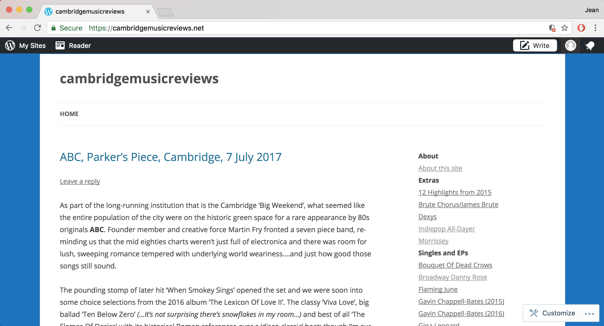

# cambridgemusicreviews

## Synopsis
A place to develop scripts associated with https://cambridgemusicreviews.net


## Motivation
The main contributor to the cambridgemusicreviews site wants to maintain it with minimal technical intervention.  Anything we can do to script maintainance of the site will be welcomed. The following video show some manual work maintaining the site index which we would like to make less manual.


### Examples:
```python capture_cmr_pages.py```
generates a set of files called page_text_1.html, page_text_2.html,... a local archive of the current state of the CMR site.

```python make_index_html.py``` 
generates a file called test.html which can be used to update the html for the index widget in the page.

```python django/mysite/manage.py runserver```
runs a web sever, e.g. visit http://127.0.0.1:8000/polls/

## Understanding the scripts
The scripts should have documentation in the comments, but also there is sample code in .  
https://github.com/jeanflower/cambridgemusicreviews/tree/master/examples  
to illustrate how we might use some functions. 

To run all example code (and check it all still compiles!)  
```python run_examples.py```

## Tests and quality
There are python unit tests in the tests folder.  These should always pass.

To run the unit tests:  
```python -m unittest discover tests```  
To geneate coverage data:  
```coverage run -m unittest discover tests/```  
This repo is under codacy review
[](https://www.codacy.com/app/jeanflower/cambridgemusicreviews?utm_source=github.com&amp;utm_medium=referral&amp;utm_content=jeanflower/cambridgemusicreviews&amp;utm_campaign=Badge_Grade)
To update codacy coverage data,  
```coverage xml```  
```python-codacy-coverage -r coverage.xml```

## Contributors
Initially set up by Jean Flower.


